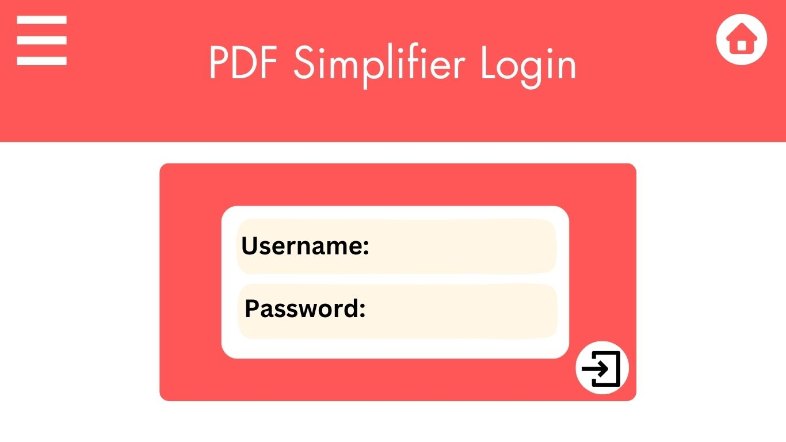
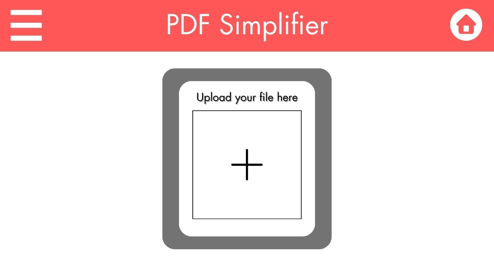
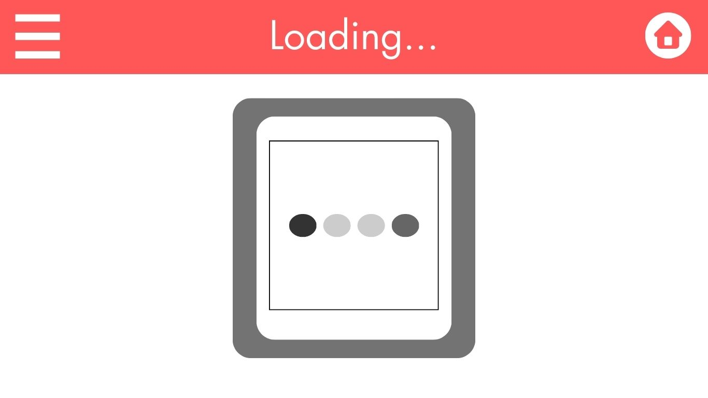
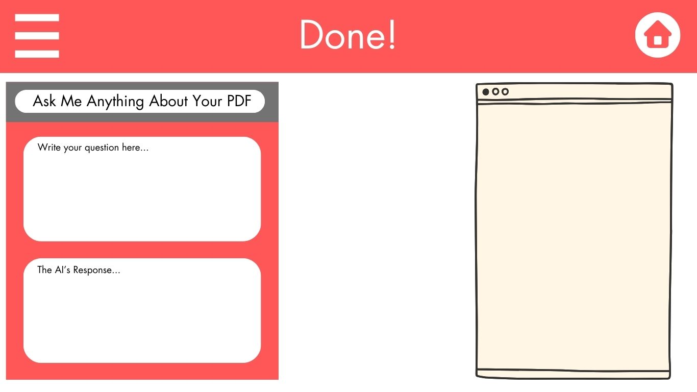

# PDF simplifier

### Elevator Pitch
Have you ever had a super long PDF or document that you didn't want to read? What if I told you that there was a website that would read a PDF and make it easier for you to understand by providing an AI assistant for you to ask questions? This amazing tool is called *pdfsimplifer.click* and it was made for you.

### Design
Here is my front-end design for my project. A back-end design will be added later.

### Key Features

- Secure login over HTTPS

- Ability for the user to upload their own PDFS

- Ability for the User to download their simplified PDF.

- An AI chat box is provided for the user to ask questions.

- Past PDFs of the user are stored in their account.

### Technologies
I will utilize the technologies in the following ways.

-**HTML** HTML Structure is showcased through the structure of the webpage. There will be three web pages. This includes creating the layout for the PDF viewer, user dashboard, and AI chatbox. One page will be used for the introduction page. Another page will be for the User's Dashboard. The last page will be for the Login.

-**CSS** Application's styling is used in chatboxs, screen headers, PDF displayers, and dynamic colors. 

**JavaScript** Provides login capability, button connections, and collection of text box information. It will also be used to implement the AI chatbox, handle PDF uploads, and make the user experience smoother.

**Service**
    - Login Endpoints
    - Manage User's data.
    - Retrieving the previous PDFs
    - Storing and submitting PDFs

**DB** Will be used to store the User's PDFs and login data.

**Login** Registers and logins the user. User credentials are stored in the database.

**WebSocket** The web socket will be used for real-time communication with the AI assistant.

**React** React will help build the PDF viewer, the user dashboard, and the AI chatbox.

## HTML Deliverable

-**HTML Pages**: There are three main HTML pages. One for the Login and Landing page. One page to sign up and register. The last page is dedicated to the PDF station, chatbot, and user interface.
-**Links**: On the top of each page there are multiple links to help the user navigate to the next page. Furthermore, on the Login page if the user hits the login button they are navigated to the upload_station portal.
-**Text**: Much of the AI Chat box is represented by a textual description.
-**3rd party**: The ChatBox will call an API in the chatbox area. Plus, the User's interface of PDF's will store all of the PDF's through a 3rd party system.
-**Images**: On the Login page there is a basic login picture.
-**Login**: There are login and submit buttons for the user to sign up or login.
-**Database**: The users PDF's are pulled from the database. 
-**Websocket**: The AI chatbox will need to be connected to the Web so that it can respond in real time.

## CSS Deliverable
For this deliverable I properly styled the application into its final appearance.

- **Header, footer, and main content body** - All of the headers, footers, and content bodies are custmized to the page they impact.
- **Navigation elements** - I made a dropdown menu to help ease navigation.
- **Responsive to window resizing** - My app looks great on all window sizes and devices.
- **Application elements** - Used good contrast of colors and shadow uses.
- **Application text content** - Consistent fonts and reoccuring color uses suggests great organization.
- **Application images** - I made my image larger usings CSS.

## JavaScript deliverable

For this deliverable, I made the Login, Sign-Up,Station Page Work.

- **login** - When you press the login button on the sign-up or login page it will display the user's name on the upload station page.
- **database** - User's name is stored in the local storage and is displayed on the upload station page.
- **WebSocket** - The User is able to send a message to the Chat bot on the page and then have it send back an answer. *Note this feature is only suppose to send back an error has occured because I'm planning on connecting the actual response in a later deliverable.* 
- **application logic** - The application has data validation feature which when a user inputs their name into the login that they will be able personalize their documentation page to display the users name. There will also hopefully, be a database intergration in the future for this. Furthermore, the pdf upload will only work if there is pdf. Anything else will not work or display.

|URL|HTTP Method| Purpose | Data type Stored|
|---|-----------|--------------------|------------|
|`/login`| POST | Holds the login info| str |
|`/signup`| POST | Holds the signup info| str |
|`/chatbox`|POST| Holds Chat messages| str|

## Service deliverable

For this deliverable I added backend endpoints that catch login and signup information

- **Node.js/Express HTTP service** - The Endpoints are looking great for loin and signup. You can use these commands to check 
    - curl -X POST -H "Content-Type: application/json" -d '{"username": "NewUser", "password": "NewPassword"}' http://localhost:4000/signup
    - curl -X POST -H "Content-Type: application/json" -d '{"username": "John", "password": "mypassword"}' http://localhost:4000/login
- **Static middleware for frontend** - done!
- **Calls to third party endpoints** - I didn't have time to implement this. 😔
- **Backend service endpoints** - Placeholders for login that stores the current user on the server. Endpoints for voting.
- **Frontend calls service endpoints** - I did this using the fetch function.
$ ./deployFiles.sh -k ~/OneDrive/Desktop/CS_260/my_start_up/wjw37.pem -h pdfsimplifer.click -s startup