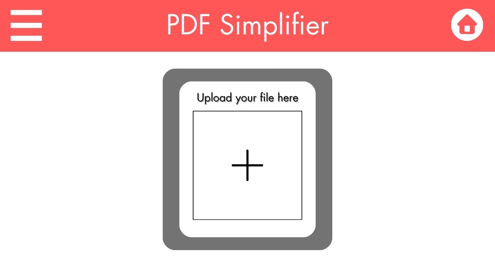
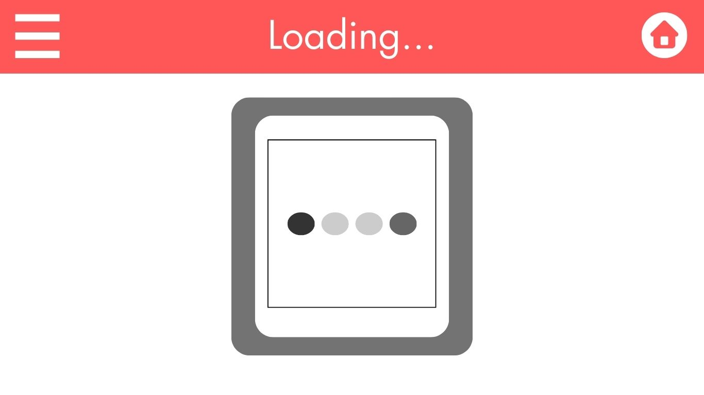
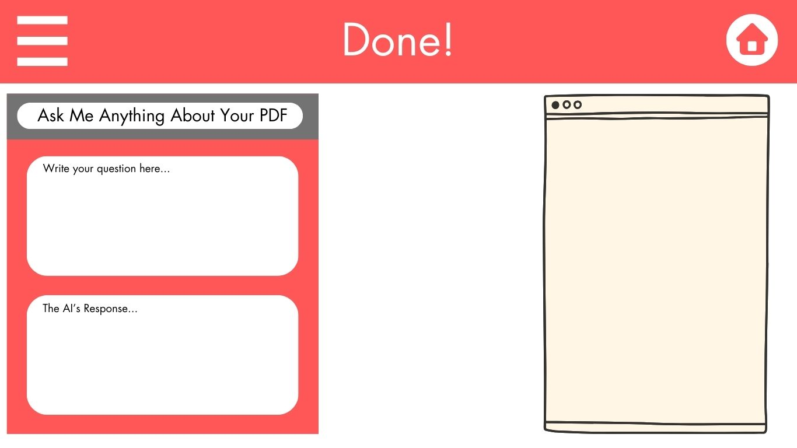

# PDF simplifer

### Elevator Pitch
Have you ever had a super long PDF or document that you did want to read? What if I told you that there was a website that would read a PDF and make it easier for you to understand and provided an AI assistant for you to ask questions to? This amazing tool is called *pdfsimplifer.click* and it was made for you.

### Design
Here is my front end design for my project. A back-end design will be added later.

### Key Features
-Secure login over HTTPS
-Ability for the user to upload their own PDFS
-Ability for the User to download their simplified PDF.
-An AI chat box is provided for the user to ask questions is created.
-past PDF's of the user are stored in their account.

### Technologies
I will utilize the teachnolodies in the following ways.

-**HTML** HTML Structure is showcased through the structure of the webpage. There will be three webpages. This includes creating the layout for the PDF viewer, user dashboard, and AI chatbox. One page will be used for the introduction page. Another page will be fror the User's Dashboard. The last page will be for the Login Page.

-**CSS** Application's styling is used to in chatboxs, screen headers, PDF displayers, dynamic colors. 

**JavaScript** Provides login capability, button connections, and collection of text box information. It will also be used to implement the AI chatbox, handle PDF uploads, and make the user experience smoother.

**Service**
    - Login Enpoints
    - Manage Users data.
    - Retreiving previous PDF
    - Storing and sumbiting PDFs

**DB** Will be used to store the User's PDFs and login data.

**Login** Registers and logins the user. User credentials are stored in the database.

**WebSocket** The websocket will be used for real-time communication with the AI assistant.

**React** React will help build the PDF viewer, user dashboard, and integrate the AI chatbox.